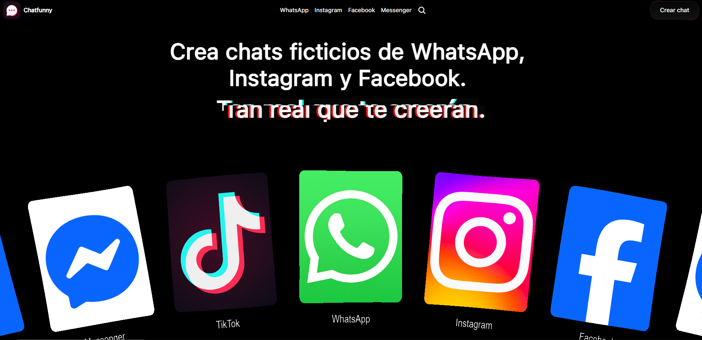
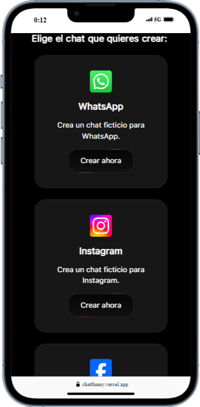

# Chatfunny

Crea chats ficticios de WhatsApp, Instagram, Facebook y Facebook Messenger. Personalizá cada conversación al máximo y sacá capturas como si fueran reales. Ideal para contenido, memes o storytelling.

- 💻 **Demo**: https://chatfunny.vercel.app/
- 📲 **Ver demo en YouTube**: https://www.youtube.com/watch?v=JRoF44n_YXs

---

## 🚀 Funcionalidades

- Crea chats de WhatsApp, Instagram, Facebook y Messenger.
- Subida de imágenes y videos en el chat.
- Elige quién envía los mensajes.
- Modificá el nombre del contacto, estado de conexión, y foto de perfil.
- Tomá capturas de pantalla directamente desde la app.
- Elimina mensajes enviados.
- Enviá y respondé mensajes como si fuera real.
- Diseño responsive para desktop y mobile.

---

## 🛠️ Tecnologías

- [Next.js](https://nextjs.org/)
- [React.js](https://es.react.dev/)
- [TypeScript](https://www.typescriptlang.org/)
- [Tailwind CSS](https://tailwindcss.com/)
- [Python](https://www.python.org/)
- [Django](https://www.djangoproject.com/)
- [html-to-image](https://www.npmjs.com/package/html-to-image) (para capturas)
- [Framer Motion](https://motion.dev/) (animaciones)

---

## 🖥️ Vista previa




---

## 🔑 Instalación local:

```bash
git clone https://github.com/CarlosDanielOK/Chatfunny.git
cd Chatfunny
npm install
npm run dev
